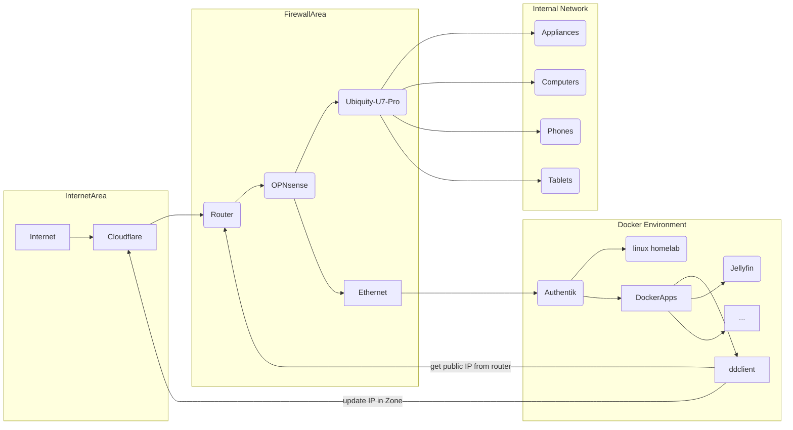

Maintaining a stable connection to your network resources can be challenging, especially when dealing with constantly changing IP addresses. Whether you're hosting a website, running a server, or accessing your home network remotely, Dynamic DNS (DDNS) services offer a solution by mapping your dynamic IP address to a domain name. Among the plethora of DDNS clients available, ddclient stands out as a reliable and versatile tool for automating the management of dynamic DNS configurations.

## What is ddclient?
ddclient is an open-source Perl-based client used to update dynamic DNS entries for various DDNS service providers. It supports a wide range of protocols, including DynDNS, No-IP, DuckDNS, Cloudflare, and many others, making it a flexible choice for users with diverse needs. Whether you're a home user looking to access your network remotely or a business maintaining an online presence, ddclient offers seamless integration with popular DDNS providers, ensuring that your domain always points to the correct IP address.




## Installation
Installing ddclient is a straightforward process on most Linux distributions. You can typically find it in the official package repositories using your distribution's package manager. For example, on Ubuntu or Debian-based systems, you can install ddclient using the following command:

### Native
```bash
sudo apt-get install ddclient
```

ddclient's configuration file follows a simple syntax, allowing users to define parameters such as the DDNS service provider, login credentials, and domain information.
Once installed, you can configure ddclient by editing its configuration file located at `/etc/ddclient.conf`

### Docker
I prefer to Dockerize most of my services, below is a docker compose example:
```yaml
services:
  ddclient:
    image: "lscr.io/linuxserver/ddclient:latest"
    container_name: ddclient
    restart: unless-stopped
    environment:
      - PUID=0 # root user
      - PGID=0 # root user group
      - TZ=Europe/Zurich # change to your location
    volumes:
      - /root/docker/ddclient:/config  # change path to your volume if needed
```

Now lets edit `/root/docker/ddclientddclient.conf`

Here is a Cloudflare config template, you need to change
* zone
* login
* password
* the list of domains or subdomain to update in that zone

```bash
daemon=300                              # check every 300 seconds
syslog=yes                              # log update msgs to syslog
pid=/var/run/ddclient/ddclient.pid      # record PID in file.
ssl=yes                                 # use ssl-support.  Works with

use=web, web=ipv4.icanhazip.com
protocol=cloudflare, zone=acme.com, ttl=1, login=cloudflare-login-email@acme.com, password=cloudflare-api-key subdomain.acme.com,subdomain1.acme.com,subdomain2.acme.com,subdomain3.acme.com
```

Start ddclient container now by running
```bash
docker-compose up -d

# If using docker-compose-plugin
docker compose up -d
```
