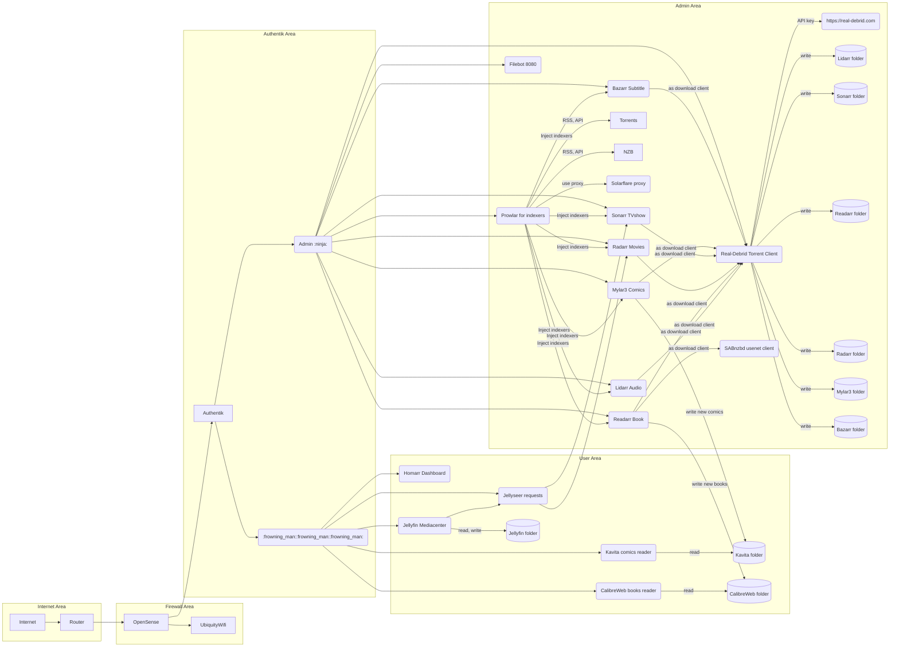


Pirating content for personal use is legal in Switzerland due to its copyright laws, which allow individuals to download and use copyrighted material for private, non-commercial purposes (you pay a premium tax on storage devide for that!). This is based on the principle of personal use under Swiss law, and no penalties are imposed for such actions. However, uploading or sharing copyrighted material, as well as distributing pirated content, remains illegal.


## Automation Architecture


Real-Debrid Torrent Client https://github.com/rogerfar/rdt-client
All Arr-tools listed https://github.com/Ravencentric/awesome-arr



[Link to Gist](https://gist.github.com/cedricwalter/76b3237a0909e971120b12bcfc88b5de)

There is no easy way to script it more, you need to define an administrator login in each tool, and remove in all rr tools any configuration errors.

# Jellyfin and IPTV

IPTV is really a first class citizen in Jellyfin, no need to run Xteve or udproxy! just add m3u url in dashboard

here is a great list of free IPTV m3u list
https://github.com/iptv-org/iptv

some channels will be geo blocked

# Jellyfin universe
A great list of all addons, clients you can use:
https://github.com/awesome-jellyfin/awesome-jellyfin/

# Running Filebot for free
If you have some media that require renaming, Filebot can quickly rename a bulk of media files by pulling their metadata from specific resources. This is great until the application became closed source or behind the paywall. There are many forks of the last open-source version, but the repo from coppit/filebot is a docker container with web-UI. The old version 4.9.7 is still open source and is mroe than enough to support plex or jellyfin.

Here is a simple docker compose file using https://hub.docker.com/r/coppit/filebot

Use proper USER_ID/GROUP_ID, one reason you'd want to run the container under the same UID and GID as your user is so that any files created by the container in the host file system will be owned by you

```yaml
version: '3'
services:
  filebot:
    container_name: filebot
    image: coppit/filebot
    env_file: .env
    environment:
      - WIDTH=1920
      - HEIGHT=1080
      - USER_ID=1000 # use the right value by running: id -u $USER
      - GROUP_ID=1000 # use the right value by running: id -g $USER
    ports:
      - 8080:8080
    volumes:
      - /root/docker/filebot:/config:rw
      - /my/my_media_path:/media:rw
    restart: unless-stopped
```
To get the web UI working, we need first to modify the `filebot.conf` that is located in the `/config` folder.

```bash
sed -i 's/RUN_UI=no/RUN_UI=yes/' /root/docker/filebot/filebot.conf
```
Once done, run the command docker-compose up -d and open a web browser and the URL is http://<ip-addr>:<8080 and it should take you the web interface of the coppit/filebot container.
This docker image use [Apache Guacamole](https://guacamole.apache.org), [Apache Guacamole](https://guacamole.apache.org) provides access to much of the functionality of a desktop from within your web browser.

Open the [Apache Guacamole](https://guacamole.apache.org) menu, it is a sidebar which is hidden until explicitly shown. On a desktop or other device which has a hardware keyboard, you can show this menu by pressing
* Shift+Control+Command (Macos)
* Ctrl+Alt+Shift (windows)

Choose "Input Method" the value "Text Input" so you can cut and paste inside the desktop.

For Jellyfin, you can use the following format (right click, then select movie, then use)
`{plex.derive{" by $director"} { [imdb-$imdbid] } {" [$vf, $vc, $ac]"}}`
but also
`{plex}``
may be enough.

# Goodbye Plex, Hello Jellyfin! The Future of Media Servers
I made the switch from Plex Media Server to Jellyfin due to its open-source nature, better privacy protection, cost-effectiveness, compatibility with more file formats, and customization options. With a growing community of users and developers behind it, Jellyfin is poised to become an even stronger contender in the media server market. If you are looking for a reliable and feature-rich alternative to Plex, give Jellyfin a try – I'm confident that you won't be disappointed!

### Why Did I Switch from Plex?
1. One platform to rule it all. Even if not as good as dedicated software I can use Jellyfin and manage all my needs
* Jellyfin Books instead of calibre (I still use it to convert and add metadata)
* Jellyfin AudioBooks, instead of audiobookshelf
* Jellyfin Photos, instead of photoprism
* Jellyfin Comics instead of Kavita
* Jellyfin Music, together with Musicbrainz Picard, Apple music plugin, Last.Fm plugin,

2. Open Source: One of the primary reasons for choosing Jellyfin was that it is an open-source project. This means that its codebase is available for anyone to view, modify, or contribute to. In contrast, Plex is a closed-source solution with limited customization options and potential security risks due to proprietary software.

3. Privacy: With Jellyfin being open source, it provides better privacy protection compared to Plex. As an end-user, you can have more control over your data and ensure that no third parties are tracking or collecting information about your media consumption habits.

4. Cost: Jellyfin's has no premium plan. All users get transcoding for free! In plex, all user need a Plex premium pass (119€ lifetime). Plexamp is free and great but Finamp will be catching soon on the number of features.

5. Compatibility: Jellyfin supports more file formats and codecs out-of-the-box compared to Plex. This means that you can enjoy your media library in its original format without having to worry about compatibility issues, ensuring the best possible viewing experience.

6. Customization: As an open-source project, Jellyfin offers a plethora of customization options for both users and developers alike. You can tailor the platform to fit your specific needs or contribute back to the community by improving its features. Plex, on the other hand, has limited customization options due to its closed-source nature. Jellyfin has still plugins, so no need to wait for a spcial features (at the cost of stability and vulnerabilities)

### Benefits of Jellyfin Over Plex
1. Community Support: With a growing user base and an active development team, Jellyfin receives regular updates and improvements from passionate contributors. This ensures that you are always using the latest features and bug fixes available in the media server world.

2. Plugin Ecosystem: Jellyfin's plugin ecosystem is more extensive and better supported by its community. This means that you can find a wider range of plugins for your specific needs or interests.

3. Mobile Apps: Jellyfin offers official mobile apps for iOS and Android devices, providing seamless access to your media library on the go.

# Jellyfin Tips and Tricks
1. Activate the unofficial Apple Music plugin
2. Jellyfin run best in Linux, windows is a joke, windows or macos let you use Backblaze unlimited desktop backup for $75 a year, but linux not.
3. Hide you real IP behind a DNS proxy using Cloudflare Free
4. Update your floating IP, using DDCLient
5. Add a NGINX reverse proxy for having HTTPS

## Do not use a Raspberry Pi, an Intel N100 is way better for Jellyfin, Plex

The Intel NUC (Next Unit of Computing) n100 and the Raspberry Pi 5 are both small form factor computers, but they have different capabilities and use cases.

The Intel NUC n100 is equipped with an Intel Core processor (either i3 or i5), which offers better performance than the Raspberry Pi 5, which uses a more basic ARM-based processor.

You can get a fully fledged Intel N100 with 16GB RAM, 2TB SSD for $180 on Aliexpress.

The Intel NUC n100 is typically comes with up to 8GB-16GB of DDR4 RAM, while the Raspberry Pi 5 has currently a maximum of 4GB LPDDR4 RAM. More RAM allows for smoother multitasking and running more memory-intensive applications or games on the Intel NUC n100 compared to the Raspberry Pi 5.

The Intel NUC n100 supports various storage options, including SSDs (Solid State Drives) for faster data access and HDDs (Hard Disk Drives) for larger capacity. In contrast, the Raspberry Pi 5 uses an SD card as its primary storage medium, which is slower and has a limited capacity compared to traditional hard drives or SSDs.

The Intel NUC n100 can run various operating systems like Windows, Linux, or macOS, providing more flexibility in terms of software compatibility and user experience.

The Intel NUC n100 has more expansion options such as additional storage slots, multiple USB ports, and support for various peripherals like monitors, keyboards, and mice. Intel N100 has Quicksync, a hardware decoder for transcoding (up to 6 stream in 1080p concurently)

The Intel NUC n100 consumes more power than a Raspberry Pi 5 because it uses a more powerful processor and has additional features, which might make it less suitable for energy-efficient applications or when using limited power sources. However, the Intel NUC n100 can be more efficient in terms of performance per watt compared to traditional desktop computers due to its compact design and optimized components.

## Cleaning up the Music library once for good
* Don't use FLAC, it is a RELIGION and science has proven that MP3 320mbps CBR is the same! https://www.reddit.com/r/DJs/comments/sp5981/there_is_no_meaningful_discernible_difference/
* Use Musicbrain Picard to add meta tags and rename
* Use MediaHuman Audio converter to convert everything to mp3

## Jellyfin on a laptop: restrict battery to not load over 70%
If you use a notebook to power your homelab, it is recommended to not let the Li-Ion stays at 100%, 

```bash
apt install tlp
vi /etc/tlp.conf

# Battery charge level below which charging will begin. 
START_CHARGE_THRESH_BAT0=50
# Battery charge level above which charging will stop.
STOP_CHARGE_THRESH_BAT0=60
```

and restart the daemon

```bash
service tlp stop
service tlp start
```

## Using USB and avoiding USB disks to SUSPEND in Ubuntu

```bash
apt install tlp
vi /etc/tlp.conf

# set to 0
USB_AUTOSUSPEND=0
```

and restart the daemon

```bash
service tlp stop
service tlp start
```

## Jellyfin permission to write on USB disks

### How to mount properly disks with jellyfin native (not docker)
```bash
sudo useradd media # create a new user 'media'
sudo usermod -aG media jellyfin # add the user jellyfin to the media group.
sudo usermod -aG media $user # add yourself to the media group

blkid # You can find the UUID of the USB disk using the `blkid` command.

id $user
# uid=1000(xxxx) gid=1000(xxxx) groups=1000(xxxx
id media # get the id of user media
# uid=1001(media) gid=1001(media) groups=1001(media)

sudo vi /etc/fstab # edit the fstab or use the disk gnome utils to change each disk mount option
# uid=1000 you are still the owner
# gid=1001 group 'media' can write to it
# umask=002 mean rwxrwxr--x
/dev/disk/by-id/xxxxxxxxxxxxxx /mnt/xxxxx auto nosuid,nodev,nofail,x-gvfs-show,uid=1000,gid=1001,umask=002 0 0

# verify that file is valid
sudo mount -a

# save and reboot
sudo reboot
```

In Ubuntu, when USB disks are auto-mounted on the desktop, they are typically mounted with permissions that allow the user who inserted the USB disk to read and write to it. If Jellyfin is running as a different user, such as the `jellyfin` user, it may not have the necessary permissions to write to the auto-mounted USB disk.

To address this, you can adjust the mount options for the USB disk to grant appropriate permissions. Here's a step-by-step guide:

1. **Identify the USB disk:**
   - Connect the USB disk to your system.
   - Run the following command to identify the device name of your USB disk:
     ```bash
     lsblk
     ```
     Look for your USB disk in the output. It will be listed as a block device (e.g., `/dev/sdX`).

2. **Find the USB disk mount point:**
   - Run the following command to find the current mount point of your USB disk:
     ```bash
     df -h
     ```
     Look for the entry corresponding to your USB disk. Note the mount point (e.g., `/media/username/usb_disk`).

3. **Modify the /etc/fstab file:**
   - Edit the `/etc/fstab` file to include the appropriate mount options for the USB disk. Open the file in a text editor with root privileges, such as `sudo nano` or `sudo gedit`:
     ```bash
     sudo nano /etc/fstab
     ```
   - Add an entry for the USB disk. Replace `/dev/sdX1` and `/media/username/usb_disk` with the actual device and mount point:
     ```bash
     UUID=your-usb-disk-uuid /media/username/usb_disk ntfs-3g defaults,uid=jellyfin,gid=jellyfin 0 0
     ```
     You can find the UUID of the USB disk using the `blkid` command.

4. **Save the changes and exit the editor.**

5. **Remount the USB disk:**
   - Unmount and then remount the USB disk to apply the new settings:
     ```bash
     sudo umount /media/username/usb_disk
     sudo mount -a
     ```

6. **Verify permissions:**
   - Check the permissions of the USB disk to ensure that the `jellyfin` user has the necessary rights:
     ```bash
     ls -l /media/username/usb_disk
     ```

Now, Jellyfin should have the appropriate permissions to read and write to the auto-mounted USB disk. Adjust the instructions based on your specific paths and configuration. Always exercise caution when editing system files and make backups before making significant changes.

## Useful Jellyfin scripts

## Find all duplicates
Poor man approach that does the job
```bash
find /mediapath -name "*.mkv" -exec basename {} .mkv \; > list.txt
find /mediapath -name "*.mp4" -exec basename {} .mp4 \; >> list.txt
find /mediapath -name "*.avi" -exec basename {} .avi \; >> list.txt
find /mediapath -name "*.wmv" -exec basename {} .wmv \; >> list.txt
sort list.txt | uniq -cd
```

### Delete all jellyfin duplicates
This script is able to find and delete duplicate files using MD5 checksums. It uses an associative array to store MD5 values and corresponding file paths. The only drawback of this methos is that it is really slow, all file need to be read (IO) and hash one after the other.

Create a file `vi dup.sh` and `chmod +x dup.sh`
```bash
#!/bin/bash
declare -A file_md5_map

find "$1" -type f | while read -r file; do
    md5=$(md5sum <(cat "$file") | awk '{ print $1 }')

    if [ -n "${file_md5_map[$md5]}" ]; then
        echo "Duplicate found:"
        echo "  File 1: ${file_md5_map[$md5]}"
        echo "  File 2: $file"

        read -p "Do you want to delete the duplicate file? (y/n): " choice
        [ "$choice" == "y" ] && rm "$file" && echo "File deleted: $file" || echo "File not deleted: $file"
    else
        echo "."
        file_md5_map["$md5"]=$file
    fi
done
```
run with `./dup.sh /media/paths`

# Return on investment: real streaming costs


Pirating content for personal use is legal in Switzerland due to its copyright laws, which allow individuals to download and use copyrighted material for private, non-commercial purposes (you pay a premium tax on storage devide for that!). This is based on the principle of personal use under Swiss law, and no penalties are imposed for such actions. However, uploading or sharing copyrighted material, as well as distributing pirated content, remains illegal.

But support artists you really like and go to the cinema!


Here's a general table listing popular video and music streaming providers along with their approximate prices in Switzerland. Prices may vary based on subscriptions or promotions, so I recommend verifying with the respective service provider for precise amounts.

| **Provider**             | **Price in Switzerland (CHF) in January 2025**           |
|---------------------------|------------------------------------------|
| **Video Streaming**      |                                          |
| Netflix                  | ~11.90 to 24.90 (Basic to Premium)       |
| Disney+                  | ~12.90/month                             |
| Amazon Prime Video       | ~6.99/month                              |
| Apple TV+                | ~8.90/month                              |
| Sky Show                 | ~14.90/month                             |
| Paramount+               | ~9.90/month                              |
| YouTube Premium          | ~15.90/month (includes YouTube Music)    |
| **Music Streaming**      |                                          |
| Spotify                  | ~12.95/month (Individual)                |
| Apple Music              | ~12.90/month (Individual)                |
| Deezer                   | ~12.90/month (Individual)                |
| Tidal                    | ~13.99/month (HiFi)                      |
| Amazon Music Unlimited   | ~9.99/month (Prime Members)              |
| YouTube Music            | ~15.90/month (via YouTube Premium)       |

## Support me

[Buy me a coffee](https://www.buymeacoffee.com/cedricwalter)
