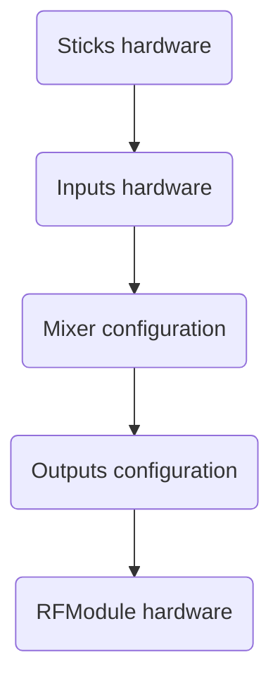

Always refer to the EdgeTX documentation for any specific details or features that may have been added or modified in the firmware.


## ELRS RotorFlight electric and nitro R/C Helicopters model templates

https://github.com/bob01/etx-templates

## Model images, splash.png,

### White background for edgeTX
Goes to THEMES/EdgeTX/background.png but rename the original one to THEMES/EdgeTX/background-default.png first

### Splash with edgeTX logo
Goes to IMAGES/splash.png but rename the original one to IMAGES/splash-default.png first
[alt text](edgeTX/splash.png)

### Sab Raw 420, 580
   !

## Limiting servo travel with Rates, Endpoints, a curve with three points, or a mixer ?

You need always to have perfect and symetrical travel on both side of your servo, the bigger the better (higher resolution, throw and speed). Never try to limit the travel in a bad mechanical setup.
It is also advised to start from a blank model if you dont remember was was set up.


Here's a brief overview of each method:

In EdgeTX, the "input" (stick positions) from the sticks travels to the RF channel output (signal out the RF module) like this:

### **Input Menu (Rates and Expo):**
- **Pros:**
    - Easy to set up.

- **Cons:**
    - Increase od decrease stick sensitivity
    - Inputs handle trims correctly.
    - Rates mainly affect the control surface travel, and the actual servo travel is influenced by the mechanical setup of your model. If you find that rates alone are not sufficient to achieve the desired servo travel limits, you may need to combine rate adjustments with other methods like endpoints, curves, or mixers.

- **How to Set Up:**
    - Choose the channel or control surface you want to adjust.
    - Increase/Decrease the sensitivity, causing the control surface to move more for a given stick input. This can indirectly  increase/decrease the travel of the servo.

### **Endpoints in Menu Outputs:**
- **Pros:**
    - Easy to set up.
    - Direct adjustment of the endpoints for each channel.
- **Cons:**
    - Limited to linear adjustments.

- **How to Set Up:**
    - Navigate to the "Outputs" or "Channels" menu.
    - Locate the option for adjusting endpoints for the specific channel controlling your servo.
    - Set the endpoints to limit the travel of the servo.

### **Curve with 3 Points:**
- **Pros:**
    - Provides more control over the servo's response.
    - Non-linear adjustments possible.
- **Cons:**
    - Requires understanding of curve settings.

- **How to Set Up:**
    - Navigate to the "Curves" menu.
    - Choose a 3-point curve for the specific channel.
    - Adjust the curve to limit the servo travel as needed.

### **Mixer:**
- **Pros:**
    - Flexible and powerful for adjusting multiple parameters.
    - Can be used for both linear and non-linear adjustments.
- **Cons:**
    - More complex than the other options.
    - For airplanes, reducing the travel using mixer weights requires four adjustments: two in the aileron mixes, and two in the elevator mixes.

- **How to Set Up:**
    - Navigate to the "Mixer" menu.
    - Create a new mixer line for the channel controlling your servo.
    - Adjust the endpoints or add a curve within the mixer settings.

**Which is Best?**

- If you only need linear adjustments and simplicity, use Endpoints in the Menu Outputs.
- If you require non-linear adjustments or a more customized response, a Curve with 3 Points may be better.
- If you need maximum flexibility and want to control multiple parameters, consider using a Mixer.

Visit https://rc-soar.com/edgetx/basics/index.php for getting more insights about whats happening in edgeTX processing loop.


Ultimately, the best method depends on your specific needs and how comfortable you are with the complexity of each option. It's a good practice to experiment and test your setup to ensure it meets your expectations.

## Low RSSI (Received Signal Strength Indicator)?
When you encounter a low RSSI (Received Signal Strength Indicator), it indicates a weak signal between the transmitter (remote control) and the receiver on the model. This can lead to potential control issues and is something that should be addressed promptly. Here's a step-by-step guide on what to do when you get a low RSSI index:

* Check Transmitter Batteries:
Ensure that the batteries in your transmitter are fully charged. Low transmitter battery levels can contribute to a weak signal. If needed, replace or recharge the batteries.
* Inspect Antennas:Examine both the transmitter and receiver antennas for any damage or improper positioning. Ensure that the antennas are straight and not obstructed by other components. Proper antenna orientation is crucial for optimal signal reception.
* Check for Interference:
Identify and eliminate sources of interference. Other electronic devices, power lines, or Wi-Fi signals can disrupt the radio signal between the transmitter and the helicopter. Fly in an area with minimal interference if possible.
* Verify Range and Line of Sight:
Ensure that you are within the recommended operating range of your RC system. Additionally, maintain a clear line of sight between the transmitter and the helicopter. Obstacles and physical barriers can weaken the signal.
* Inspect Receiver and Wiring:
Examine the receiver and its wiring for any visible damage. Loose connections or damaged wires can affect signal reception. Securely fasten all connectors and replace any damaged components.
* Antenna Placement:
Make sure the receiver antenna on the helicopter is positioned correctly. It's often recommended to have the antenna extended and away from other electronic components to reduce interference.
* Update Firmware:
Check if there are any firmware updates available for both the transmitter and the receiver. Manufacturers may release updates that improve signal strength and overall system performance.
* Use an External Antenna:
If the RSSI issue persists, consider using an external antenna for the receiver. Some aftermarket antennas may provide better signal reception than the stock antennas.
* Perform a Range Test:
Conduct a range test in a controlled environment to determine the maximum distance at which you can maintain a reliable signal. This will help identify any specific areas or distances where signal strength drops significantly.
* Consult Manufacturer Support:
If the issue persists after trying the above steps, contact OMP Hobby's customer support for assistance. They can provide specific guidance and may offer solutions or replacement parts if necessary.
Always prioritize safety when troubleshooting RSSI issues, and avoid flying in conditions where a weak signal could lead to loss of control.
